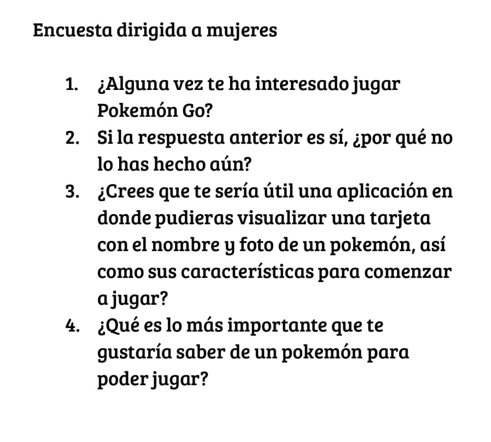

# Data Lovers

---
##Diseño de la Interfaz de Usuario
---
Elegimos el tema del presente proyecto con base a la cantidad de data con la que contabamos inicialmente en nuestro pokemon.js. 
Iniciamos realizando encuentas para determinar cual tema era el que más le interesaba a las personas. 

Los datos que obtuvimos al finalizar la primera encuesta fue que era pokémon. 

Después gráficamos la cantidad de hombres y mujeres que juegan o jugaban pokémon Go y se nos hizo muy interesante el sesgo tan grande que existe, en este punto nos dimos cuenta que había muy pocas mujeres interactuando con el juego. Fue por ello que decidimos entender el ¿por qué?...

En el proceso encontramos que muchas chicas, aunque estaban interesadas jamás lo habían jugado porque sentían que no contaban con los conocimientos necesarios para ser una buena jugadora, y de ahí nació nuestra aplicación. 

Iniciamos creando un prototipo de baja calidad

Nuestra aplicación pretende convertirse en una herramienta efectiva, fácil de usar, amigable con la usuaria, con la finalidad de que adquiera los conocimientos básicos para adentrarse en el mundo pokémon.

