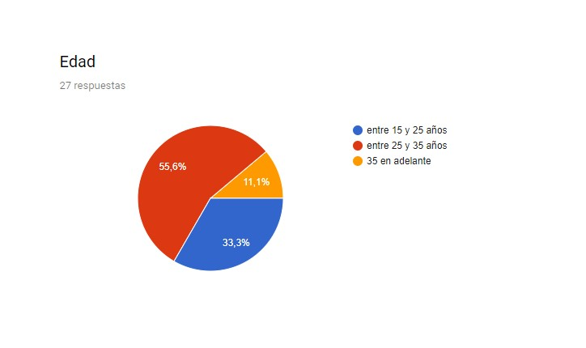
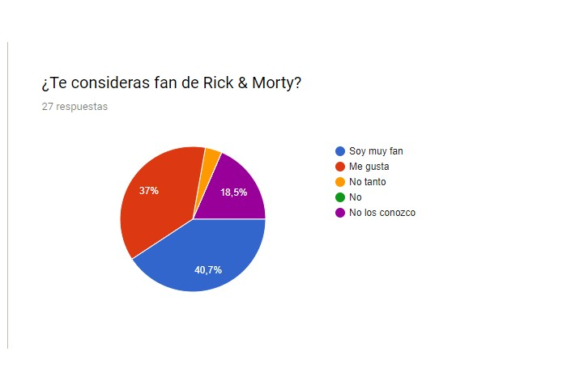
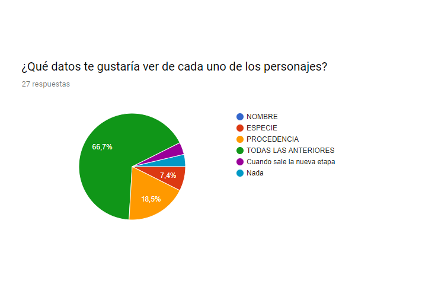
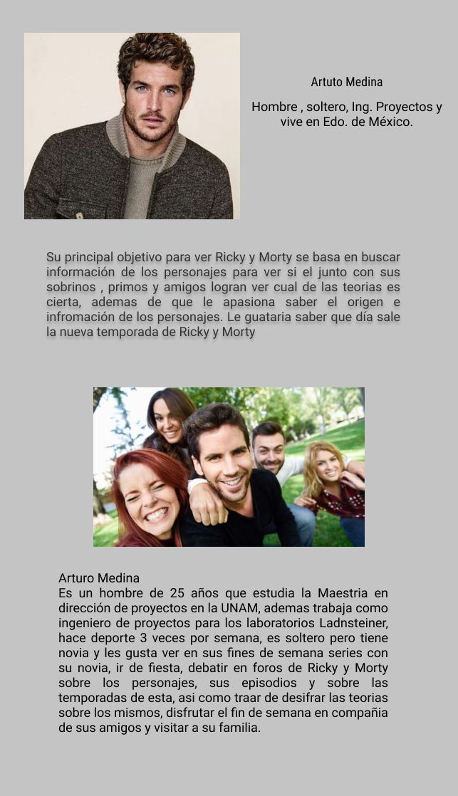
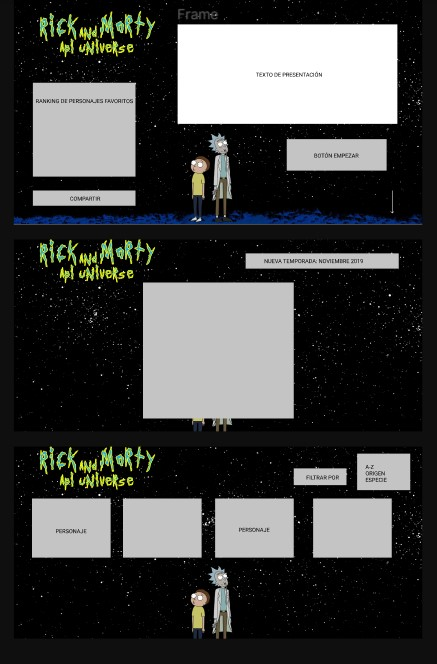

# Rick y Morty API Universe
	

Rick y Morty Api Universe promueve la ayuda a los fans de Rick y Morty a saber más sobre datos sobres los personajes, la cronología , las temporadas y los cambios que se han visto en esta serie.

## *Objetivo*

Realizar un sitio que sea amigable, agradable y de fácil manejo y entendimiento por parte de los fans de Rick and Morty que están interesados en saber más sobre los personajes.

## Resultados de la Encuesta

Para poder determinar a los usuarios que serían los indicados para tener una app de Ricky and Morty se realizaron encuestas en línea y presenciales, esta fue resuelta por 27 personas, 13 hombres y 14 mujeres, la cual no s arrojo lo siguiente:

 
 **

## ¿Qué edad tienes?
**
Los principales usuarios del producto según los resultados arrojados por la entrevista realizada en cuanto edades de los usuarios se muestran en la primera gráfica, al 55.6 oscila entre los 25 a 35 años, el 33.3 oscila entre los 15 a 25 años y solo el 11.1 mas de 35 años. Algo que nos hizo darnos cuenta que no solo los jóvenes son los principales consumidores potenciales de la app, sino que también a personas maduras les resulta atractivo contar con una app de Ricky and Morty.

          

**
**
## ¿Qué tan fan eres de Ricky and Morty?
Cabe mencionar que la encuesta también nos arrojo lo siguiente 40.7 % son muy fans del Ricky y Morty, al 37 % le gusta, 3.8% No tanto y el 18.5 % no los conoce, estos resultados se puede observar en la segunda gráfica.

          
**

## ¿Qué te interesa conocer de la Ricky and Morty?

 Los objetivos de estos usuarios en relación con el producto es conocer acerca de los personajes de la serie y de esta forma sacar algunas conclusiones hechas sobre esta serie por parte de los usuarios.

**
## ¿Qué te interesa ver en una App de Ricky and Morty?
Los resultados arrojados por la entrevista realizada se muestran en la tercera gráfica, a los entrevistados les interesa ver en un 66.7% el nombre, especie y la procedencia de los personajes que son parte de Ricky and Morty. A un 18.5% solo les interesa ver la procedencia, a un 7.4% únicamente la especie y al resto de los encuestados no les interesa, o bien, quieren saber cuando sale la nueva temporada.

          
- **

## ¿Cuándo utilizan o utilizarían el producto?

Los resultados que arrojo la encuesta nos dice que el usuario ocuparia la app para conocer datos de los personajes que no recuerdan de la serie, o para resolver algunas de la dudas existentes sobre los personaje de la misma.

El resultado total de las encuestas nos arroja que se tiene una amplia gama de usuarios a los que les interesa y les llama la atención el uso de una app de Ricky and Morty. Por lo que se concluyo que sin duda es una buena oportunidad de desarrollo web una app de Ricky and Morty.
  
  **

## Proto-Persona

Revisando información obtenida a través de redes sociales nos percatamos que en cuanto a genero en su mayoría son hombres con un 65% en comparación de las mujeres que representan un total de 35%.

Se vio que el contenido que se observa en las paginas y redes sociales de Ricky and Morty son principalmente memes, mercadotecnia y por ultimo la creación de hipótesis o teorías sobre los personajes de la serie.

Otra parte importante de la investigación fue que notamos que la serie esta dirigida a millenials, jóvenes y adultos que refleja la locura, la desfachatez, el sarcasmo y el humos negro que los fans de la serie reflejas o les gustaría reflejar en su vida.

Con todo lo anterior deducimos que nuestra proto-persona son jóvenes y adultos desde 15 hasta 35 años que trabajan y/o estudian y que utilizan las redes sociales en su mayoría toda la semana, que disfrutan de ser desfachatados, del sarcasmo y del humor negro, viendo en la serie de Ricky y Morty una oportunidad de divertirse, relajarse y disfrutar de la desfachatez de la vida.

Cabe mensionar que la proto-persona no se diseño con forme a una edad en especifico dado que Ricky and Morty cuenta con una gama muy amplia en cuanto a edad por lo que se diseño principalmente por el gusto que tienen las personas por Ricky y Morty mas que por edad

          
**

# Problematica

Una vez que se analizo los datos obtenidos en las encuestas definimos lo siguiente:

El usuario(a) requiere una aplicación que muestre a los personajes de Ricky and Morty así como los datos mas relevantes sobre estos,al igual que las temporadas sobre estas y un avance sobre la nueva temporada  de Ricky and Morty.

**
## Historias de Usuario
A continuación algunas historias de usuarios que comenzamos a definir:

          
**

**
## PROTOTIPADO

Una vez concluido nuestra investigación con los usuarios se paso al prototipo de App de Ricky and Morty, el cual se mostró a nuevos usuarios para que nos retroalimentaran sobre su expectativa sobre esta, se realizaron los cambios mencionados según la información de los usuarios y el resultado con el que los usuarios satisface sus necesidades es el siguiente:
  

          
**
