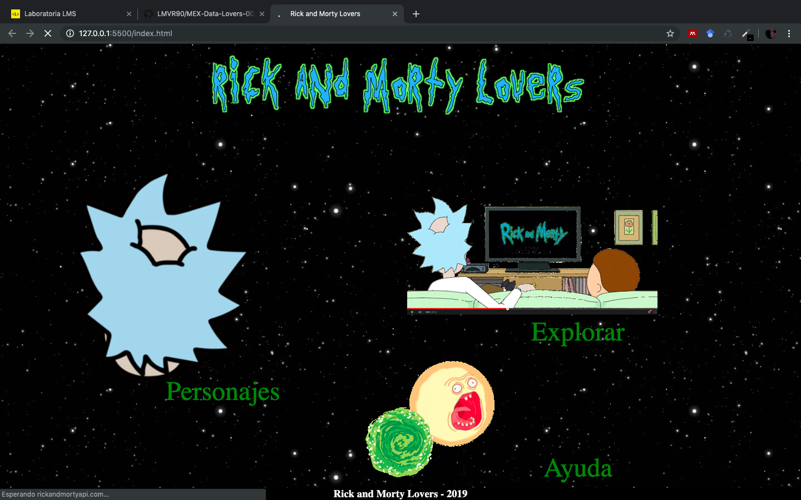

Marcela Vasquez <luzmarcelavasquez@gmail.com>

Archivos adjuntos13:58 (hace 0 minutos)

para mí
# Rick & Morty Lovers

.gif)

## Introducción

Rick & Morty es una serie animada emitida por primera vez en 2013 para el bloque de programación [Adult Swim](https://es.wikipedia.org/wiki/Adult_Swim) de Cartoon-Network. Posteriormente comenzó a emitirse en Netflix, expandiendo su alcance de audiencia, hasta convertirse en una de las series más populares de los últimos años.

Fue a través de Netflix que Rick & Morty llegó a Latinoamérica en octubre de 2016 y desde entonces se ha hecho de una buena base de viewers que crean fansites y grupos en redes sociales para compartir información sobre la serie.

## Presentación

Nosotras creamos Rick and Morty Lovers. Una web app que permite a lxs fans acceder a información sobre su serie favorita.

El universo de personajes, planetas y dimensiones de Rick & Morty es ENOOOOORME por eso decidimos crear una web app que permita explorar más a fondo este vasto multiverso.

## Proceso de diseño y creación

### Research

Realizamos una encuesta que fue respondida por 42 personas. En ella identificamos que lxs viewers son principalmente jóvenes de entre 18 y 25 años aunque la audiencia entre los 26 y 30 años es también considerable. La mayoría son estudiantes y en cuanto a género, están distribuidos entre hombres y mujeres en una proporción cercana al 50-50%.

### Perfil de usuarix y decisiones de funcionalidad y diseño:

Dada esta investigación llegamos a la conclusión de que los posibles usuarixs de nuestro sitio web serian mas que nada jóvenes en un rango de edad de 18 a 30 años. Que son seguidores de la serie dada su popularidad, temática e irreverencia, es por eso que deseamos reflejar en nuestro sitio web todas estas caracteristicas mediante una interfaz atrevida, interactiva y visualmente atractiva.

De acuerdo con esta investigación identificamos que dentro de un app con data sobre la serie a lxs usuarixs les interesa:

- Identificar con detalle las características de lxs personajes.
- Saber cuáles y cuántos son los planetas y dimensiones que hasta ahora han aparecido en la serie.
- Ubicar a los personajes por episodios en los que aparecen.

### Ideación y prototipado

Con base en esta información creamos un prototipo de baja fidelidad y uno de altafidelidad que fueron testeados con potenciales usuarixs.

[Prototipo de baja fidelidad - Sketch](https://marvelapp.com/i799b14)

[Prototipo de alta fidelidad](https://www.figma.com/file/arFqgZBPF1os2JB29YD5kp82/Untitled?node-id=0%3A1)

### Información técnica

El sitio fue creado con Javascript (ES6), HTML5 y CSS3.

## Resultado

Después de testear los prototipos decidimos eliminar la pantalla de Planetas ya que a lxs usuarixs potenciales no les generó el interés ni la utilidad esperadas.

El resultado es una web app con 4 secciones:
- La primera de bienvenida con botones animados:

- La siguiente es la de Personajes. En ella se despliega el contenido principalla que es la data de los personajes, junto con las opciones de filtrado y ordenamiento de la misma.

- La tercera es la página "Explorar" en la que lxs usuarixs y visitantes del sitio pueden encontrar otros sitios de interés sobre la serie.

- Finalmente en la sección "Acerca de" en la que se da información general sobre Rick and Morty Lovers.

En la página hacemos uso de múltiples gifs creados con los personajes para crear un ambiente divertido y atractivo para lxs fans de la serie que visiten el sitio.

## Checklist

- [x] Usa VanillaJS.
- [x] No hace uso de `this`.
- [ ] Pasa linter (`npm pretest`)
- [ ] Pasa tests (`npm test`)
- [ ] Pruebas unitarias cubren un mínimo del 70% de statements, functions y
      lines y branches.
- [x] Incluye _Definición del producto_ clara e informativa en `README.md`.
- [ ] Incluye historias de usuario en `README.md`.
- [x] Incluye _sketch_ de la solución (prototipo de baja fidelidad) en
      `README.md`.
- [x] Incluye _Diseño de la Interfaz de Usuario_ (prototipo de alta fidelidad)
      en `README.md`.
- [ ] Incluye el listado de problemas que detectaste a través de tests de
      usabilidad en el `README.md`.
- [x] UI: Muestra lista y/o tabla con datos y/o indicadores.
- [x] UI: Permite ordenar data por uno o más campos (asc y desc).
- [x] UI: Permite filtrar data en base a una condición.
