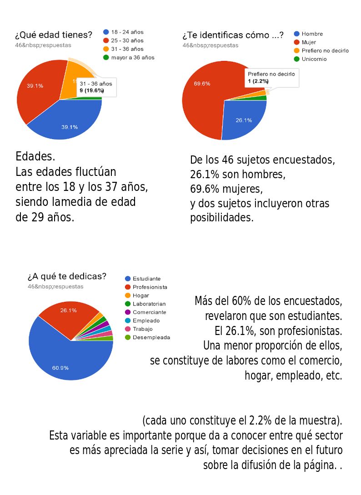
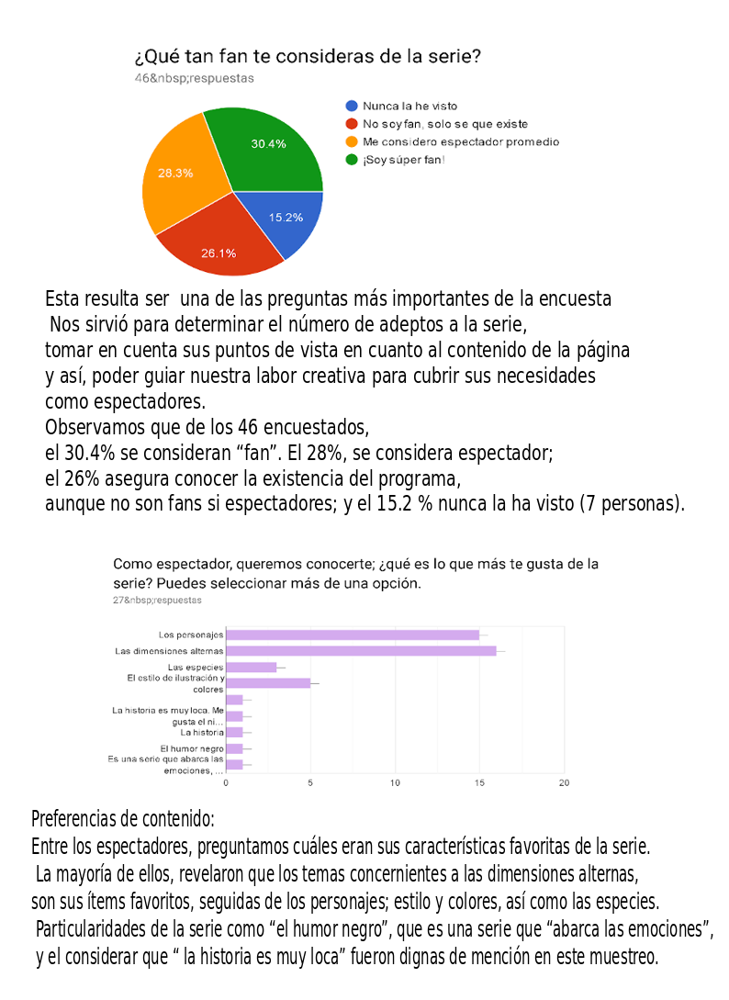
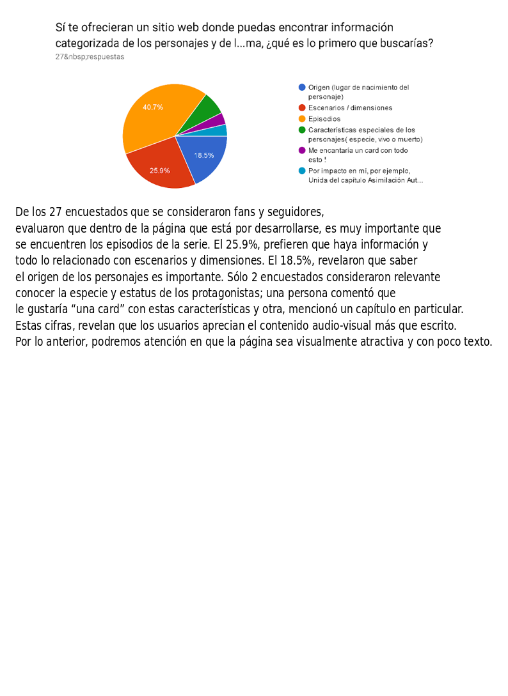
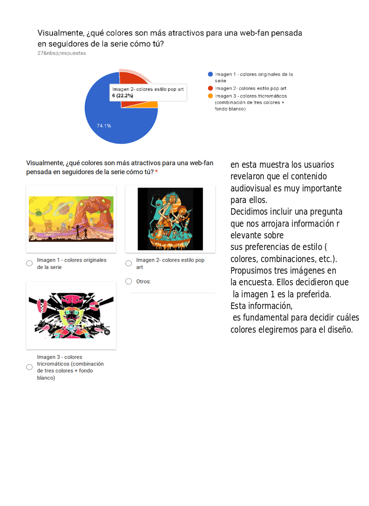
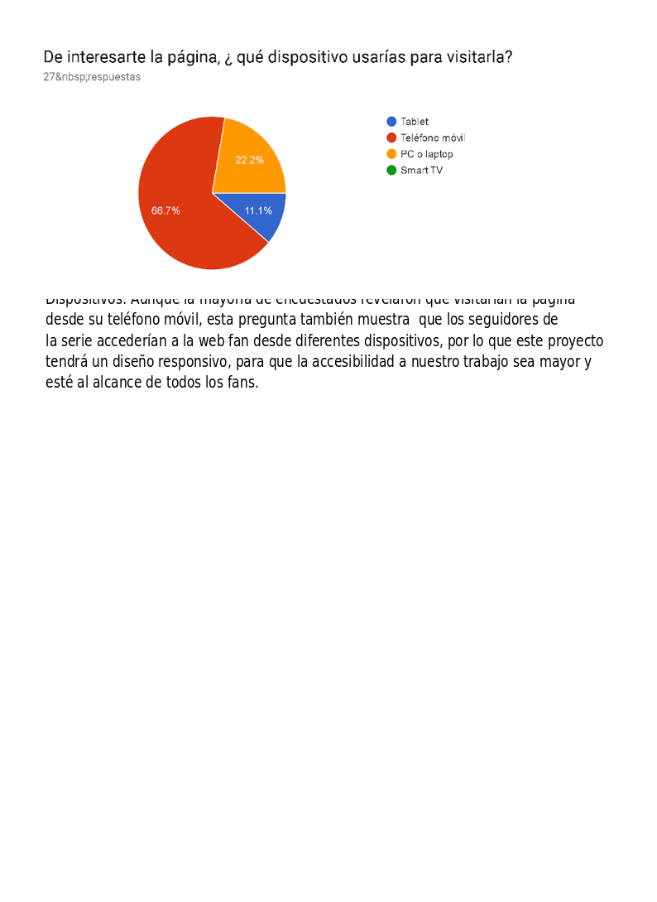
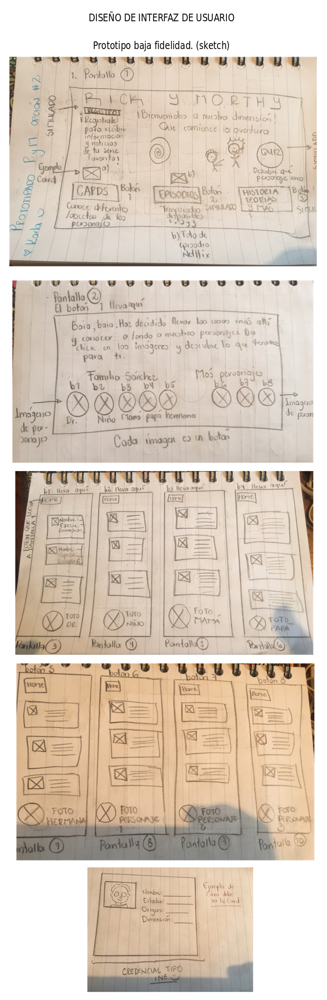
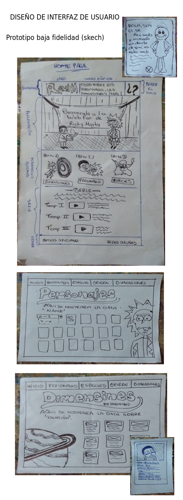

Descripción del producto:

El presente trabajo se fundamenta en las inquietudes de los aficionados a la serie de Rick y Morthy. Durante nuestra investigación, descubrimos que no existen sitios especializados del programa, que ofrezcan a sus espectadores el contenido que sacie su curiosidad y ayude a dilucidar cuestionamientos que provoca la trama de la misma. Es decir, se ha detectado una demanda real y no cubierta para los seguidores de la serie. Debido a lo anterior, proponemos una página web que ponga a su alcance (al menos como primer intento de cubrir la necesidad antes mencionada) una categorización de los personajes de acuerdo a las siguientes cualidades: Nombre, especie, estatus, locación, género y episodio en donde aparecen cada uno.
A través de un diseño fluido, intuitivo, amigable y atractivo para el público que lo solicita, ofrecemos una página colorida y que satisfaga las necesidades de la muestra encuestada compuesta por  46 sujetos. 

A continuación, describimos el método empleado para la obtención de los datos que nos sirvieron como eje en la construcción de nuestro producto:

   Herramienta: Encuesta de Google constituida por preguntas cerradas con 3 y 4 niveles de respuesta. Dichas preguntas, fueron organizadas por secciones con el objetivo de discernir entre los espectadores asiduos de la serie y los que no tenían información de la misma. 

   Muestra: La encuesta fue difundida a través de redes sociales ( Slack, WhatsApp, Facebook); obtuvimos una muestra aleatoria constituida por 46 sujetos. En la siguiente sección, mostramos las características de los sujetos encuestados:

   PROCESO DE DISEÑO

Rick y Morthy es una serie animada creada en 2013. El desarrollo de este historia, presenta a Rick Sánchez, un científico con una particular personalidad ; ha viajado en muchas dimensiones. Morthy, nieto de Rick, un adolescente  de 14 años , sigue a su  abuelo en aventuras interplanetarias y multidimensionales y sirve también como conejillo de pruebas.
Visualmente, maneja una gama de colores amplia, sin embargo, los predominan los morados, rosas, azules, y distintos  tonos  de  verdes (el portal). Esto nos permite usar una gama dinámica que represente la serie. Además, al acercarnos a los usuarios de manera aleatoria, nos mencionan que, aún sin haber visto un capítulo completo, pueden recordar alguno de los colores antes mencionados.

Decimos realizar dos prototipos de baja fidelidad  (sketch) para plasmar la posible maquetación de nuestro prototipo de alta fidelidad y testear. Sugerimos  una pantalla principal (imagen representativa), un menú en la parte superior/ inferior con las secciones que se podrá visualizar la data de acuerdo a la necesidad del usuario.

HISTORIA DE USUARIO

Entrevista 1

“Mi nombre es Lizbeth, tengo 22 años, soy estudiante. Me gusta la serie de Rick y Morthy, y me considero espectadora promedio.
Lo que me llamas la atención es  el desarrollo de los personajes y las dimensiones alternas. En algún momento busqué su página oficial pero solo aparecieron resultados de pequeños  foros al respecto. Me gustaría encontrar una página web donde pueda saber un poco más de las dimensiones y los personajes.
Es importante una  web de la serie donde toque algunos temas de algunos episodios, ya que a veces, son muy científicos y no todos conocemos esas teorías;  estaría padre un sitio que te ofrezca información al respecto.

CÓMO: Seguidora de la serie 
QUIERO : Web fan que me permita visualizar información relevante y ordenada de Rick y Morthy.
PARA: Informarme de la trama, entender las teorías  y personajes. 

